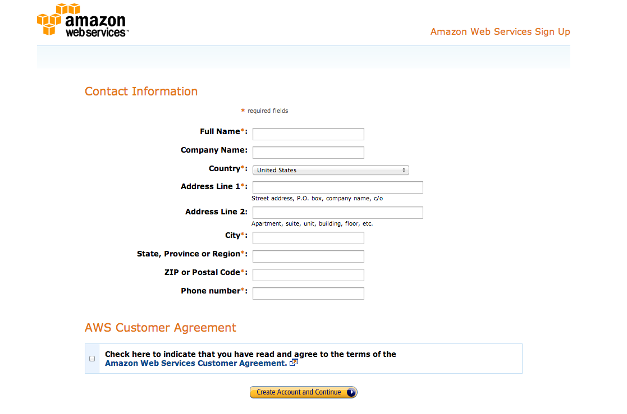
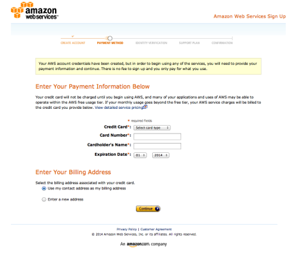
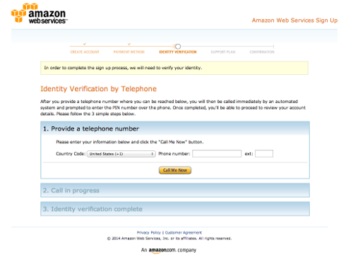
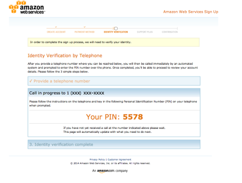
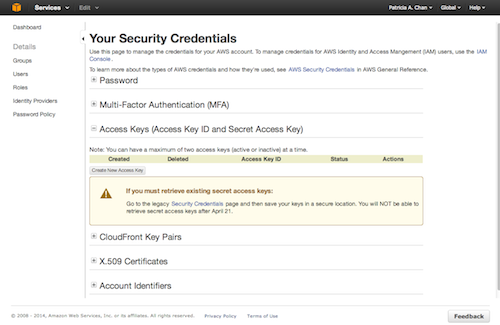
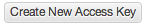
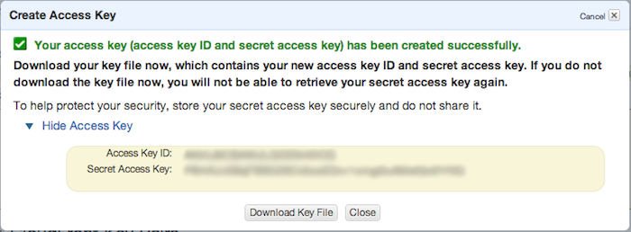
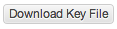

Getting setup with Amazon Mechanical Turk
==========================================

**psiTurk** is a system for interfacing with Amazon
Mechanical Turk.  Thus, you need to create an account
on Amazon's website in order to use it.  There are a number
of steps involved here which have to do with signing up with Amazon.
Luckily they are a one-time process (possibly once for your
entire lab if everyone shares a single AWS account).

Creating an AWS account
~~~~~~~~~~~~~~~~~~~~~~~

Start by going to the Amazon Web Services page `here <http://aws.amazon.com>`__. If you made a Mechanical Turk account prior to this, sign in to your account and may skip to the next paragraph. Otherwise, click the Sign Up button at the top.

You should be redirected to a form asking for your contact information. Fill out the form and continue to the next section.

Next, you will need you credit card and your phone. The form should now ask for your credit card information.

If you do not see the forms to fill in your credit card information, go to the Payment Methods page either by clicking the link on the toolbar to the left or `here <https://portal.aws.amazon.com/gp/aws/developer/account?ie=UTF8&action=payment-method>`__. Enter in your credit card information. (Amazon will only charge you, if you use their cloud services. Signing up for an account should not incur any charges.)

On the next page, you will be asked to enter your phone number. Have your phone nearby. After you put in your phone number the webpage will display a 4-digit pin code and Amazon will call you. Enter the pin on your phone's keypad when prompted by the call.

Amazon will ask you to select a support plan. For the purposes of psiTurk, you only need the Basic(Free) plan. Click continue.

Your Amazon Web Service account should be set up now.

Obtaining AWS credentials
~~~~~~~~~~~~~~~~~~~~~~~~~

An AWS access key id and secret access key is required for posting new HITs to Mechanical Turk as well as monitoring existing HITs. If you created an AWS access key and did not save your secret access key, you will need to create a new access key. After April 21, 2014, AWS no longer allows users to retrieve their secret access key. Follow the steps below to create a new key.

You can create your keys after you open an Amazon Web Services account. Your keys can be generated in the `AWS Management Console <https://console.aws.amazon.com/iam/home?#security_credential>`__.

Click on the "Access Keys" tab. Your screen should look like this:

Press the "Create New Access Key" button to generate a set of access keys.

A popup window should appear on the screen to tell you that your access key has been created. Your access keys will appear in the popup box.

If you do not see your access key, click the "Show Access Key" link in the popup box.

We recommend that you also download your access keys just in case. The "Download Key File" button will download the keys onto your computer in a CSV file.

The values of these keys need to be placed in your global ``~/.psiturkconfig`` file. The file is by default located in your home directory
(see `Configuration files <configuration.html>`__ for more info)

.. note::

    If you are using IAM authentication, **psiTurk** requires that the *AmazonMechanicalTurkFullAccess* policy be added to the credentials it uses to connect to MTurk.
    See `here <http://docs.aws.amazon.com/AWSMechTurk/latest/AWSMechanicalTurkGettingStartedGuide/SetUp.html#create-iam-user-or-role>`__ for how to set up an IAM user.

Creating an AMT Requester account
~~~~~~~~~~~~~~~~~~~~~~~~~~~~~~~~~

To use your AWS keys to interface with Amazon Mechanical Turk, you need to create a requester account.
Please see `Amazon's instructions <http://docs.aws.amazon.com/AWSMechTurk/latest/AWSMechanicalTurkGettingStartedGuide/SetUp.html>`__ for this.  In particular, it is necessary to at least once login to the requester site (`http://requester.mturk.com <http://requester.mturk.com>`__) and also to at least once login to the sandbox requester site (`https://requestersandbox.mturk.com <https://requestersandbox.mturk.com>`__), so that you can agree to the terms of service.

Linking funds
~~~~~~~~~~~~~

Under construction.

Additional instructions
~~~~~~~~~~~~~~~~~~~~~~~

Under construction.
