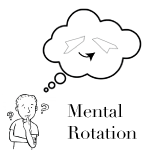
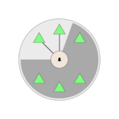
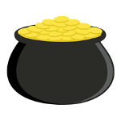
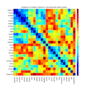
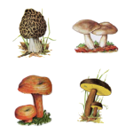
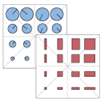
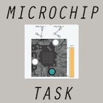
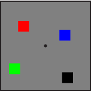
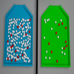

.. _experiment-exchange:

===================
Experiment Exchange
===================

The principle of the experiment exchange is to allow researchers to share the
code for psiTurk-compatible experiments, in the name of science reproducibility.
Other researchers should be able to easily download psiTurk experiment code
and re-run it using the same population and task code. In addition, researchers
can use the experiment exchange to learn about the code used in other people's
experiments.

Contributing to the exchange
============================

If you use psiTurk to design your experiment, please consider sharing the code!
To do so, do the following:

* upload your code to a GitHub repository

  * Be sure not to commit any sensitive information, such as AWS credentials
    or a :ref:`database_url <settings-database-url>` containing credentials!
* propose an edit to this page, listing information about your experiment. This
  documentation page is hosted on GitHub.

Alternatively, if you have trouble with the above, open an issue on the `project
github repository page <https://github.com/NYUCCL/psiTurk/issues>`__, and we'll
be glad to help you share your project. *Science!*

Browse experiments for study or replication
===========================================

If you find one of these to be useful, consider "star"-ing it on GitHub to show
your appreciation and to signal its usefulness to others.

.. contents:: Experiments
  :depth: 1
  :local:

Draw Together
~~~~~~~~~~~~~~~

..
  psiturk.org/ee/HW3XfPCTUjPDdtE87aHRHi

:Link: https://github.com/NYUCCL/drawtogether
:Keywords: crowd source art, fun, demo

A simple experiment where workers are asked to draw an image using their computer mouse. A custom route (/gallery) provides a visual summary of all the creative images that people drew.

Go / no-go task using jsPsych
~~~~~~~~~~~~~~~~~~~~~~~~~~~~~

..
  psiturk.org/ee/W4v3TPAsiD6FUVY8PDyajH

:Link: https://github.com/jspsych/sample-jspsych-psiturk-experiment
:Keywords: reaction time, jspsych, example

This is an example experiment to demonstrate how to use the jsPsych library with psiTurk. The experiment is a simple go/no-go task: subjects respond to blue circles as fast as possible, but ignore orange circles. Reaction times are measured and an average reaction time for correct responses is shown at the end. The experiment highlights a number of jsPsych features that can be used in a variety of experiments.

Surveillance Task
~~~~~~~~~~~~~~~~~

..
  psiturk.org/ee/uFCGAbfrs7kcxvMM5fpdzE

:Link: https://github.com/sweetticket/EC
:Keywords: recognition, reaction, psychology

This task measures attention and rapid responding.

Mental rotation of 2D line drawings
~~~~~~~~~~~~~~~~~~~~~~~~~~~~~~~~~~~

..
  psiturk.org/ee/FobiuxfN33TiqGb7poQKvN

:Link: https://github.com/jhamrick/mental-rotation-experiment-cogsci2014
:Keywords: mental rotation, mental simulation, perception, decision making

This is a behavioral experiment based on classic mental rotation studies (Shepard & Metzler, 1971; Cooper, 1975). In this experiment, participants view pairs of images and must determine whether the images depict the same object (which has possibly been rotated), or mirror-image objects (which could also be rotated). For further details, see Hamrick & Griffiths (2014), available from http://www.jesshamrick.com/publications.

Whoops y'all
~~~~~~~~~~~~

..
  psiturk.org/ee/Cv4MVqanWeXNmZyqaH8rD9

:Link: https://github.com/NYUCCL/whoops_yall
:Keywords: mistakes, payment, bad HITs

Whoops y'all is a psiTurk compatible experiment for paying people when an experiment goes badly for some reason. You enter the worker IDs of people who you owe money to and can reject all others. Payment is handled quickly and easily via psiTurk's command line features. When you make a whoops, use "whoops y'all"!

Scalar Implicatures
~~~~~~~~~~~~~~~~~~~

..
  psiturk.org/ee/wLX94vxMeKLWwNWJtTp3nX

:Link: https://github.com/fdabl/scalar-implicatures
:Keywords: pragmatics, incremental validity, decision-making

DFE sampling paradigm
~~~~~~~~~~~~~~~~~~~~~

..
  psiturk.org/ee/CAF3YHX3PNJb5SATs6uWed

:Link: https://github.com/dmarkant/SamplingParadigmDFE
:Keywords: decisions from experience, sampling paradigm, information search, decision making

The experiment implements a version of an *incremental verification task* in which binary truth-value judgments are collected for sentence-picture pairs, while the picture is only incrementally revealed upon subjects' request. The task helps to obtain information about the relative preferences for different readings of potentially ambiguous sentences from categorical answers. Interesting from a programmer's point of view is the use of [browserify](http://browserify.org/) which provides a module system for JavaScript. Using browserify `transforms <https://github.com/thlorenz/es6ify>`__
allowed us to write the experiment in the next version of JavaScript, providing
us with nice new language `features <https://github.com/lukehoban/es6features>`__.

neurosemantic features
~~~~~~~~~~~~~~~~~~~~~~

..
  psiturk.org/ee/LCBvMpyKbKvpJADTzs7Xo3

:Link: https://github.com/stubridy/neurosemantic_norming
:Keywords: stimulus norming, semantic features

This code was used to get ratings of the association between "neurosemantic" features -- features of concepts that map onto known functional specializations in the human brain (e.g., smell, color, motion) -- and single word concepts. Contains examples of using task.js to request stimulus calculation and construction from the server side via ajax calls to custom.py. The examples included query a sql database to decide which words to show a participant, but this was particular to our data storage. That code could be swapped out for anything one might use to construct stimuli and return to js client in a jsonify'ed object containing the expected fields.

SearchExperiment
~~~~~~~~~~~~~~~~

..
  psiturk.org/ee/HWAJHERZ9Zn8qm7b6t2cqM

:Link: https://github.com/kanakakis/search_experiment
:Keywords: trust

The aim of this experiment is to study the users’ trust dynamics regarding the accuracy and confidentiality of the ACME search engine

jsPsych CoffeeScript go/no-go example
~~~~~~~~~~~~~~~~~~~~~~~~~~~~~~~~~~~~~
..
  psiturk.org/ee/NiyHgcEBwwH7uQebC2oWPN

.. image:: images/ee/9sohF3uGe6bzpHLRrnJohd-v6h9dLncbDXZVQ82tzfegk.png

:Link: https://github.com/jtth/jspsi-go-example
:Keywords: demo, example, jspsych

This is an updated example of the integration between `PsiTurk <http://www.psiturk.org/>`__
and `jsPsych <http://www.jspsych.org/>`__. It is a rewrite of the example code
given in the `jsPsych tutorial <http://docs.jspsych.org/tutorials/rt-task/>`__
using Literate `CoffeeScript <http://coffeescript.org/>`__. It uses some code
used in `jodeleeuw <https://github.com/jodeleeuw>`__'s
`experiment example <http://www.psiturk.org/ee/W4v3TPAsiD6FUVY8PDyajH>`__
(also available `on GitHub <https://github.com/jodeleeuw/sample-jspsych-psiturk-experiment>`__).
It also demos post-trial data computation and collection from jsPsych to PsiTurk.

Mushroom-foraging experiments with varying horizons
~~~~~~~~~~~~~~~~~~~~~~~~~~~~~~~~~~~~~~~~~~~~~~~~~~~

..
  psiturk.org/ee/8i4L35wzj4nuGDRrYX28BM

:Link: https://github.com/NYUCCL/HorizonExperiments
:Keywords: decision making, reinforcement learning, exploration

Four experiments in which the participant plays the role of a mushroom forager attempting to eat healthy mushrooms while avoiding poisonous ones. The purpose of the experiments is to test whether people employ a *forward-looking* exploration strategy, sampling mushroom species more when they expect to see them more times (Exp 1a and 1b) or with greater frequency (Exp 2a and 2b) in the future. The repository contains four experiments. To run an experiment, first `cd` into the appropriate folder after running the `psiturk-install` command.

Biased hypothesis generation
~~~~~~~~~~~~~~~~~~~~~~~~~~~~

..
  psiturk.org/ee/dZwduSbdxaEpkqMuHtz5J

:Link: https://github.com/dmarkant/exp_biasedHypothesisGeneration
:Keywords: category learning, self-directed learning, hypothesis generation

Two experiments examining how biased hypothesis generation affects the ability
to learn categorical rules through self-directed sampling. In both experiments,
the representation of two feature dimensions is manipulated in order to affect
the kinds of hypotheses people generate as they attempt to learn an unknown
category boundary (i.e., either 1D or 2D boundaries). Experiment 1 is a
perceptual task while Experiment 2 applies the same design to a more abstract
problem.

Microchip intervention task
~~~~~~~~~~~~~~~~~~~~~~~~~~~

..
  psiturk.org/ee/JU2tj9yjs47zVdngx8jPdW

:Link: https://github.com/annacoenen/chipTask
:Keywords: causal learning; active learning; interventions

This is the causal intervention task "microchip task" used in Experiment 1 of Coenen, Rehder, & Gureckis (2015) http://gureckislab.org/papers/CoenenRehderGureckis2015.pdf. A few notes: * Caveat: This code is several years old and it is the first bit of JavaScript I've ever written. Please get in touch if I can help with any questions, at coenen.anna@gmail.com. * To change the appearance of the chips, edit static/images/mainboard.svg * To change the causal structures, you will need to change the information in static/lib/likelihoods.js, which holds outcome probabilities for every structure and every intervention, as well as the structural description of each graph.

Stroop Example with jsPsych
~~~~~~~~~~~~~~~~~~~~~~~~~~~

..
  psiturk.org/ee/Vn8uJAA2RGCSJp6pAoFgTH

:Link: https://github.com/alexanderrich/stroop-jspsych
:Keywords: stroop, simple, example, jspsych

A "port" of the psiTurk built in stroop experiment example to use jsPsych (version 6.0.0)

Change Detection
~~~~~~~~~~~~~~~~

..
  psiturk.org/ee/vAkj54oeHmGERdhgX6BoPN

:Link: https://github.com/colinquirk/PsiturkChangeDetection
:Keywords: visual working memory, K

This is the change detection task that is often used to assess working memory capacity (K). Subjects are given a number of colored circles and are asked to remember as many as possible. After a short delay, the circles return to the screen. 50% of the time, one circle will have changed colors. The subject then responds with 'S' for same or 'D' for different. The following formula can then be used to get a measure of the subject's capacity: K = (hit rate + correct rejection rate - 1) * set size

Probability Discrimination Game
~~~~~~~~~~~~~~~~~~~~~~~~~~~~~~~

..
  psiturk.org/ee/4LJugCfT5vm64vNP3wnPLA

:Link: https://github.com/ogradyso/PDG3
:Keywords: probabilistic reasoning; psychophysics

The is the code for an experiment in which people see two groups of marbles and are asked to choose the group with the greatest chances of drawing a white marble at random. It a series of images sequentially for 750ms followed by an screen to reduce sensory memory. Right/Left response data as well as reaction time data are collected for each image.

Idea Generation / Divergent Thinking
~~~~~~~~~~~~~~~~~~~~~~~~~~~~~~~~~~~~

..
  psiturk.org/ee/PaY8pUQXu2yd2wraXHEiLA

:Link: https://github.com/rickhass/Idea-Generation
:Keywords: creativity, divergent thinking, semantic memory, Alternative Uses, Consequences

This experiment allows for administration of common divergent thinking tasks (e.g., Alternative Uses for Objects). It consists of six prompts (3 alternative uses, 3 consequences) that last 3 minutes each, and a practice prompt (naming colors). The key feature of the experiment is the collection of RTs in addition to typed responses. This allows for the examination of idea generation / divergent thinking with some of the tools used by semantic memory researchers. As is, the prompts are written text, but the code can be extended to include images as prompts. An R-Markdown file with the data from a recent experiment is available on OSF (https://osf.io/eux2k), which includes details on parsing the datastring, with a customized function for quickly doing so.

1yearproject
~~~~~~~~~~~~

..
  http://psiturk.org/ee/ttJ24HLgHgoY3qcqrPf9VD

:Link: https://github.com/yangyuxue1994/1yearProject
:Keywords: picture description, cognition, language

This is a picture description task

Auditory Lexical Decision & Identification Tasks
~~~~~~~~~~~~~~~~~~~~~~~~~~~~~~~~~~~~~~~~~~~~~~~~

..
  psiturk.org/ee/grjpznf2ZbmnRj2SJHXqMk

:Link: https://github.com/JSlote/cswro-exp-1
:Keywords: auditory, spoken word, lexical decision, ldt, identification, sound, speech, speech perception

This is the code repository for Experiment One of the
`above-titled study <https://apps.carleton.edu/curricular/psyc/jstrand/assets/Slote_and_Strand_BRM.pdf>`__.
It includes implementations of auditory lexical decision and identification tasks.
The experiment is designed to be run using `psiTurk <https://psiturk.org/>`__
version 2.1.1 on the Amazon Mechanical Turk platform. Of general interest are the
following features:

  - Cursor auto-hiding during experiment proper,
  - Audio preloading including a progress bar pop-up,
  - Fullscreen requirement to mitigate distraction (participants are asked to
    enter fullscreen and the experiment is paused (all input blocked) if they exit prematurely),
  - Basic asynchronous flow control for transitioning between stages of the experiment,
  - and Audio reCaptcha integration (you will have to input your reCaptcha keys
    in custom.py and task.js for this feature to function).

You are welcome to use this code for personal or academic uses. If you use all
or portions of this project in an academic paper, please cite as follows:

  Slote, J., & Strand, J. (2015). Conducting spoken word recognition research online: Validation and a new timing method. *Behavior Research Methods*. doi: 10.3758/s13428-015-0599-7. For more information about this study or the Carleton Perception Lab, please visit https://apps.carleton.edu/curricular/psyc/jstrand/research/resources/
