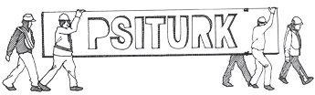

psiTurk Documentation
=====================

Welcome to **psiTurk**'s documentation. To learn more about the project
please visit `https://psiturk.org <https://psiturk.org>`__.

To actually use **psiTurk** you'll first need to install it on your local
computer or server. Instructions can be found on the `Getting psiTurk installed on your computer <install.html>`__ page.
Afterwards, head over to our `quickstart guide <https://www.psiturk.org/quick_start>`__ ,
or for a more detailed tutorial demonstrating how to setup a simple experiment
with **psiTurk**, visit `Getting up and running with the basic Stroop task <stroop.html>`__.

User's Guide
------------------
.. toctree::
    forward
    install
    amt_setup
    psiturk_org_setup
    secure_ad_server
    quickstart
    step_by_step
    anatomy_of_project
    recording
    faq
    getting_help
    disclaimer

API Reference
--------------
.. toctree::
    api

Contributing to **psiTurk**
---------------------------
.. toctree::
	contribute
	roadmap