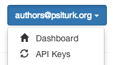

Getting setup with psiturk.org
==========================================

**psiturk.org** is a cloud-based system which provides
users with information about their hits (who has accepted
the hit, where they are located, etc...) and which 
provides a SSL-signed secure Ad server (ensuring that
the majority of Workers can access your task).  It is
offered as a free service to anyone who uses **psiTurk**.

.. note::

  To do anything beyond local testing a psiturk.org
  account is currently required.

Creating a psiturk.org account
----------------------------------

The first step in using psiturk.org is to sign up with
your email address.  A free account can be created at 
`https://psiturk.org/register <https://psiturk.org/register>`__.

Obtaining psiturk.org API credentials
--------------------------------------

To prevent your email and password from being
passed repeatedly over the Internet when using
psiturk.org, you access the psiturk.org API services
using an API key (similar to how you interface with
`Amazon Mechanical Turk <amt_setup.html>`__). To obtain your personal API keys
login to psiturk.org (`https://psiturk.org/login <https://psiturk.org/login>`__).
On the main dashboard page, select the blue dropdown
menu on the top right hand side of the page (shows your
email address) and select "API Keys".  
Copy these keys into your ``~/.psiturkconfig`` file.

At any time you can regenerate these keys on the same page by
pressing the "Regenerate API Keys" button.

At that point any old keys will no longer work, and you will
need to update your ``~/.psiturkconfig`` file again.  This
way 
