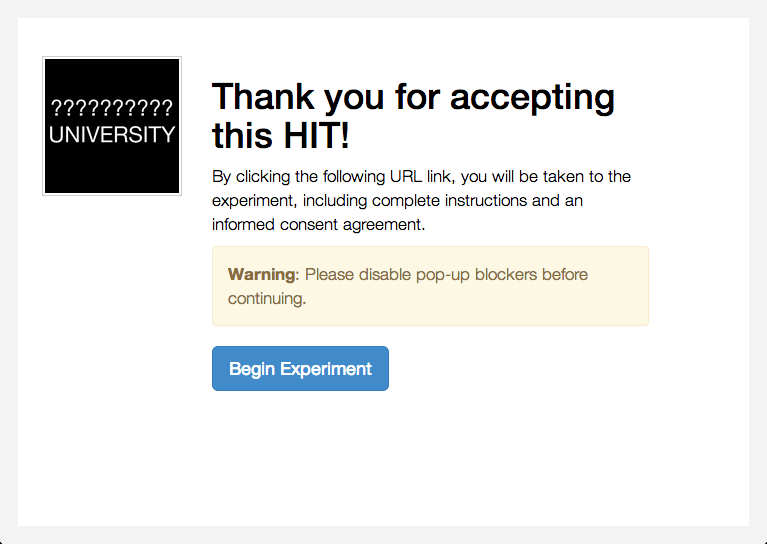
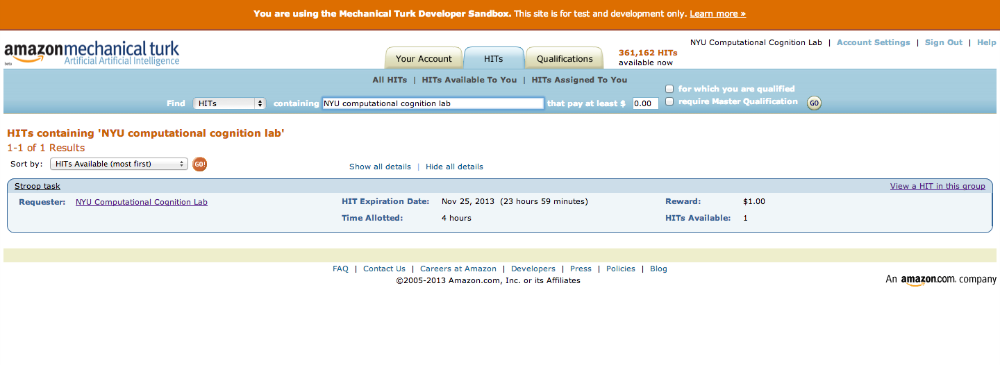

Getting up and running with the basic Stroop task
=================================================

Perhaps the best way to learn about psiTurk is to go through
the steps of configuring and running an experiment. This tutorial
will take you through the steps required to run the basic Stroop
experiment that ships default with psiTurk. This project can be a
great starting place for developing your own experiment.

.. warning::

	This guide assumes you already have the psiTurk command
	line tool installed on your computer.  If you haven't
	you should begin there and come back when it is
	installed.  Instruction `here <install.html>`__.

	This guide also assumes you are using version 1.0.10dev
	or higher of the **psiTurk** command line tool.  Type
	``psiturk --version`` in your command shell/terminal
	program to verify your version number.

Background
----------

The Stroop effect is the finding that people show interference
from reading while naming the font color of words. The task is used
to suggest that reading has become a highly "automatic" cognitive
skill. You can read more about the Stroop task `here <http://en.wikipedia.org/wiki/Stroop_effect>`__.
This guide won't comment much on the psychology of it, rather focusing on the technical
aspect of running such an experiment online that consists of a
sequence of trials and which records response time and key presses.

Initialize the demo code
------------------------

The first step is to obtain the archive of code and resources
specific to the Stroop demo. Additional
experiments are shared on the psiTurk `experiment exchange <http://psiturk.org/ee>`__.
However, the Stroop demo comes bundled within the psiturk command line tool.

First use the ``psiturk-setup-example`` command to place fresh copies of the files into
a new folder::

	$ psiturk-setup-example
	Creating new folder `psiturk-example` in the current working directory
	Copying /Users/gureckis/Library/Enthought/Canopy_64bit/User/lib/python2.7/site-packages/PsiTurk-1.0.10dev-py2.7.egg/psiturk/example to ./psiturk-example
	Creating default configuration file (config.txt)

afterward you should have a new folder in the current directory
named "psiturk-example" with the following listing of files::

	$ cd psiturk-example
	$ ls -la
	total 16
	drwxrwxr-x   6 gureckis  staff   204 Mar 31 12:18 .
	drwx------  23 gureckis  staff   782 Mar 31 12:18 ..
	-rw-r--r--   1 gureckis  staff   796 Mar 31 11:55 config.txt
	-rw-r--r--   1 gureckis  staff  3226 Mar 31 11:55 custom.py
	drwxrwxr-x   9 gureckis  staff   306 Mar 31 12:18 static
	drwxrwxr-x  19 gureckis  staff   646 Mar 31 12:18 templates

.. seealso::

	A full description of the individual files is provided `here <anatomy_of_project.html>`__.
	A few of the files described on the full documentation will not appear
	until the first time you start ``psiturk`` and launch the **psiTurk** server.

Configure your global **psiTurk** options
-----------------------------------------
When you run ``psiturk-setup-example`` the first time,
a `global configuration file <configuration.html#global-configuration-file>`__
is created in your local directory named ``~/.psiturkconfig``.
In order to get access to all the psiTurk features you need to enter credentials
for accessing Amazon Web Services and psiturk.org. Both of these can be added
to `~/.psiturkconfig`.

To access Amazon Mechanical Turk and other Amazon Web Services features you needs
to enter your AWS Credentials (see these instructions for details). You can leave
the `aws_region` at the default value.

To access psiTurk online features such as the Ad Server you need to create an
account on psiturk.org. Please visit http://psiturk.org/register to sign up or
http://psiturk.org/login to obtain your crediations. On your psiTurk dashboard
click "API Keys" and enter them into your file.

.. seealso::

	Please read more about the `global configuration file <configuration.html#global-configuration-file>`__,
	`getting set up with Amazon Web Services <amt_setup.html#creating-an-aws-account>`__, and
	`getting setup with psiturk.org <psiturk_org_setup.html#obtaining-psiturk-org-api-credentials>`__
	on their respective documentation pages.

Configure the option for the demo experiment
--------------------------------------------

Another of the files generated by ``psiturk-setup-example`` is the ``config.txt`` file,
which contains a variety of experiment and server parameters. These values can be
changed by altering the file in any text editor.

The default ``config.txt`` file is already mostly configured to help you test
the Stoop demo. Three options you might want to adjust to begin with are:

1. In the ``[Server Parameters]`` section ensure that the port listed is one that is available on your computer (answer is usually yes unless you have particular firewall software running).

2. In the ``[Server Parameters]`` section ensure that the host is either ``localhost`` (if just testing/debugging locally) or set to ``0.0.0.0`` (if planning to test live on the AMT site).

.. seealso::

	A full description of the local configuration file and the
	meaning of the various option is available `here <configuration.html#local-configuration-file>`__.

Launch the psiTurk shell
------------------------

All user commands to psiTurk, such as creating a HIT, launching the experiment server,
or approving workers, are issued through the `psiTurk command-line shell <command_line_overview.html>`__. To open the shell, run
``psiturk`` a valid experiment folder. You should see something like this (though probably
colorized on your display)::

	$ psiturk

	http://psiturk.org
	 ______   ______     __     ______   __  __     ______     __  __
	/\  == \ /\  ___\   /\ \   /\__  _\ /\ \/\ \   /\  == \   /\ \/ /
	\ \  _-/ \ \___  \  \ \ \  \/_/\ \/ \ \ \_\ \  \ \  __<   \ \  _"-.
	 \ \_\    \/\_____\  \ \_\    \ \_\  \ \_____\  \ \_\ \_\  \ \_\ \_\
	  \/_/     \/_____/   \/_/     \/_/   \/_____/   \/_/ /_/   \/_/\/_/

	             an open platform for science on Amazon Mechanical Turk

	--------------------------------------------------------------------
	System status:
	Hi all, You need to be running psiTurk version >= 1.0.5dev to use the
	Ad Server feature!

	Check https://github.com/NYUCCL/psiTurk or http://psiturk.org for
	latest info.
	psiTurk version 1.0.10dev
	Type "help" for more information.
	[psiTurk server:off mode:sdbx #HITs:0]$

The psiTurk shell prompt displays several useful pieces of information: whether the experiment server is on, whether you are in sandbox or live mode, and how many hits are online in your current mode (more on all of these below). While in the psiTurk shell, all commands entered will be executed by psiTurk. To exit the shell, type ``quit``.

.. seealso::

	More documention of the shell including documentation of each available command
	is available `here <command_line_overview.html>`__.

Start/stop the experiment server
--------------------------------

The **psiTurk** experiment server is a separate process that acts as a custom, local
web server (similar to Apache).  To launch the server type ``server on`` in the
command line interface::

	[psiTurk server:off mode:sdbx #HITs:0]$ server on
	Experiment server launching...
	Now serving on http://localhost:
	[psiTurk server:on mode:sdbx #HITs:0]$

Note that the command prompt has changed from showing ``server:off`` to ``server:on``
in this example (and also changed form red to green on colorized terminals). You can
start or stop the server at any time using the ``server on`` and ``server off``
commands. Typically you want to have the server running when you are testing locally,
testing on the AMT "sandbox", or running your actual experiment. If the server stops
when running your actual experiment, Internet users will no longer be able to
participate in your experiment even if you still have HITs posted on AMT's website.
Thus, you should think of the experiment server as meaning your experiment is current "live."

Debug/test the experiment locally
---------------------------------

Frequently you would like to test your experiment in your browser locally without
involving Amazon's servers at all. To do so, ensure that the experiment server is
running (the prompt should show ``server:on``). Then enter the command ``debug``. A new
browser tab will open with the first screen of the experiment. The URL string for this
will look something like this::

	http://localhost:22362/ad?assignmentId=debug7FIXMF&hitId=debugI3XW1P&workerId=debugY3UNQY

The ``http://localhost:22362/`` part is set in the configuration options under
``Server Parameters`` in the fields "host" and "port". The default value,
``http://localhost:22362/`` is a special term that refers to your own computer.
As mentioned above, if you wanted to run this experiment publically you would want
to change the host option to ``0.0.0.0``.

The remaining part of the URL created random (i.e., fake) identifiers which stand-in
for the values that Amazon provides identifying the user, hit, etc... Since by default
**psiTurk** does not allow individuals to take the same experiment more than once (it
checks for you to see if the worker has already completed the task or read too far into
the instructions) these random values are helpful during debugging.

.. important::

	When running in debug mode (i.e., when the ``assignmentId``, ``hitId``, and ``workerId``
	variables are prefixed with the word "debug") everything proceeds as usual.  However,
	the server will not block the same user from restarting the experiment
	after finishing the instructions (as is true normally).  This helps debugging
	since you don't have to keep inventing new fake ``workerId``.  However, good to
	keep in mind this difference.

The first page that you see in the experiment looks something like this:

This is the page the AMT worker would see when they first accept the hit. When you
click the link, a full screen window will open up which will run the experiment. You can
test it now if you like just to get a sense of things. If you want to stop midway through
that is no problem. Just close that browser window. Running debug again will open a new
browser window and let you repeat the process.

.. important::

	In the typical development cycle you would make changes to the javascript, CSS,
	or HTML files in your project locally and use ``debug`` to see those changes
	and test them.  This way the development environment is the same as the
	one in which you will eventually deploy your experiment on Mechanical Turk.

Experiment Structure
--------------------

The basic stroop demo lays out a pretty standard experiment sequence.  It is
perhaps most helpful to step through this sequence yourself, but conceptually:

First the users view an "ad" for the study (that is what is displayed above).

Then they view a consent form and are asked to verify that they read
and understood the consent.

Next they are given a sequence of instruction
screens.  The experiment logs how long they look at the each instruction
screen as well as if they shift back and forth using the next/previous
buttons.

Then the main experiment begins which dynamically re-draws
the browser window using Javascript.  The `psiturk.js API <api.html>`__
records the data and synchronizes it with your server from time to time.

After the experiment finishes the user is given a simple questionaire about
their experiences in the task.  Finally control is returned to Amazon
(or if debugging a stand-in message is displayed).

While all this is going on the `psiturk.js API <api.html>`__ records
if the user is changing windows and prevent them from reloading the
browser mid-way into the task to start over.

Launch in AMT sandbox
---------------------

Now that you've tested the experiment locally, you may want to see how it would
appear on mturk before running it live with paid workers. Amazon offers this
ability through the worker sandbox -- a simulated environment that allows developers
to test their HITs.

To create a hit in the worker sandbox, first check that the server is on and
that you are in sandbox mode; the psiTurk prompt should say on next to server
and ``sdbx`` next to mode. If you are in ``live`` mode, enter the command ``mode``
to switch to sandbox mode.  If you are in ``live`` mode it will post your task
to the live, paid AMT website instead of the free demo site.

When you are in sandbox mode if you type ``amt_balance`` you will see you have
a never ending account with $10,000.00 of fake money to spend on sandbox HITs.

::

	[psiTurk server:on mode:sdbx #HITs:0]$ amt_balance
	$10,000.00

To create a hit, enter the command ``hit create``, and then answer the prompts
to set up the HIT. Your choices for the prompt answers are arbitrary for now,
since the HIT won't be completed by real workers.  If the ``host`` variable
in the ``config.txt`` file for this project is set to ``localhost`` (default)
or ``127.0.0.1`` you will get an error reminding you that you server is
no accessible to the general Internet.  Please change this option before
trying to post your task on AMT.

::

	[psiTurk server:on mode:sdbx #HITs:0]$ hit create
	number of participants? 5
	reward per HIT? 1.00
	duration of hit (in hours)? 1
	*****************************
	  Creating sandbox HIT
	    HITid: 3SA4EMRVJV2ALPN29ZGP6BDPNBS0P0
	    Max workers: 5
	    Reward: $1.00
	    Duration: 1 hours
	    Fee: $0.50
	    ________________________
	    Total: $5.50
	  Ad for this HIT now hosted at: https://ad.psiturk.org/view/oyG8sMCn9ySLTTrumsYgHe?assignmentId=debugFOFTCL&hitId=debugTSXLIB

This example create a hit with 5 "slots" for participants (or 5 assignments).
The reward is $1.00 and the participant has 1 hour to complete the task after
accepting the HIT before it will be returned.  Finally the unique
"ad" for this experiment/HIT is displayed at the bottom.  Notice that the
ad is hosted on ``https://ad.psiturk.org`` which means it will always
be visible to virtually all participants (see more info about the
`Secure Ad Server <sercure_ad_server.html>`__).

You can also run create_hit non-interactively by providing arguments when
you run the command, for example ``create_hit 10 1.00 4``.

You should now see the number "1" next to "#HITs:" in the psiTurk prompt,
denoting that you have one active HIT in the worker sandbox. If you type
the command ``hit list active``, you should see a description of your HIT
including the HIT id::

	[psiTurk server:on mode:sdbx #HITs:1]$ hit list active
	Stroop task
		Status: Assignable
		HITid: 3SA4EMRVJV2ALPN29ZGP6BDPNBS0P0
		max:5/pending:0/complete:0/remain:5
		Created:2014-03-31T21:32:27Z
		Expires:2014-04-01T21:32:27Z

To test your HIT, go to the worker sandbox and search for your HIT by entering the name of your requester account in the search bar. You should see something like this:

Click "view a HIT in this group" to open a hit. You should see an ad for your HIT appear on the screen. Click "accept HIT", then click the link in the HIT ad to open the experiment in a full-screen window.
If you complete the HIT in this manner you it should go through all the steps of the AMT process.
Afterwards you will have some data in your `database <configure_databases.html>`__.

Accessing your data
-------------------

The simplest way to retrieve data is using the `download_datafiles
command <./command_line/download_datafiles.html>`__. This creates
three csv files containing the three kinds of data: `trial data
<./recording.html#recording-trial-data>`__, `question data
<./recording.html#recording-unstructured-data>`__, and `event data <./recording.html#browser-event-data>`__.

If you are using the default SQLLite database (see `configuring databases <configure_databases.html>`__)
then another option is to use a GUI tool like `Base <http://menial.co.uk/base/>`__ to access
the data in the ``participants.db`` file in your project folder.

If you set your database to use MySQL then you maybe able to connect and export
the data using `Sequel Pro <http://www.sequelpro.com/>`__.

Automatically computing a bonus
-------------------------------

Approve/Reject Workers
----------------------

Assigning bonuses
-----------------

Launch "live" experiment
------------------------

To launch an experiment "live" you follow the same steps as launching
in the sandbox but first set the "mode" of the command line to "live"::

	[psiTurk server:on mode:sdbx #HITs:1]$ mode
	Switching modes requires the server to restart. Really switch modes? y or n: y
	Entered live mode
	Shutting down experiment server at pid 55158...
	Please wait. This could take a few seconds.
	Experiment server launching...
	Now serving on http://0.0.0.0:22362
	[psiTurk server:on mode:live #HITs:0]$

Now if you run ``hit create`` it will post a hit on the live website.
You must have enough money in your AMT account to pay for the HITs you
are requesting, otherwise an error message will be displayed.
The ``amt_balance`` command will let you check your current balance::

	[psiTurk server:on mode:live #HITs:0]$ amt_balance
	$178.70

.. danger::

	Remember to switch back to "sandbox" mode when you are finished
	collecting data so that the command you type will not accidently
	create tasks that will charge you account money!

Further learning...
-------------------

This concludes the conceptual overview of the Stroop example that
ships with **psiTurk**.  Continue reading the `decomposing the
Stroop task <decompose_stroop.html>` section to learn more about
the gritty details.
This concludes the conceptual
